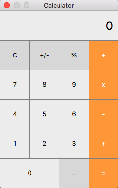

# MacOSX Calculator

A recreation/replica of the Mac OSX calculator - inspired by its beautiful and clean UI.

## Build

Building is easy provided you have Qt 5+ installed.

1. Add qmake to your bash profile, in my case it was `export PATH=$PATH:/Users/ianbastos/Qt/5.13.0/clang_64/bin`

2. cd into the repository and run `qmake .`

3. Then run `make`

4. You should now see the executable app in the repository
